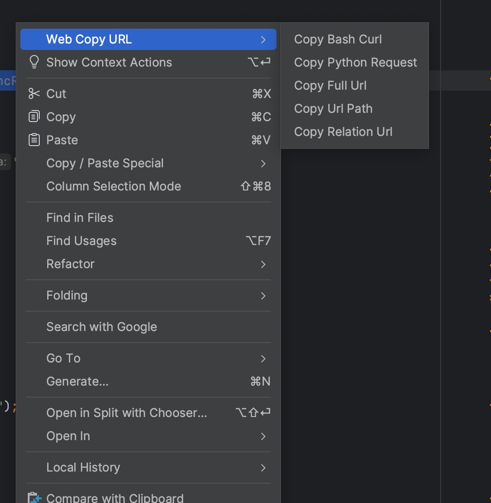
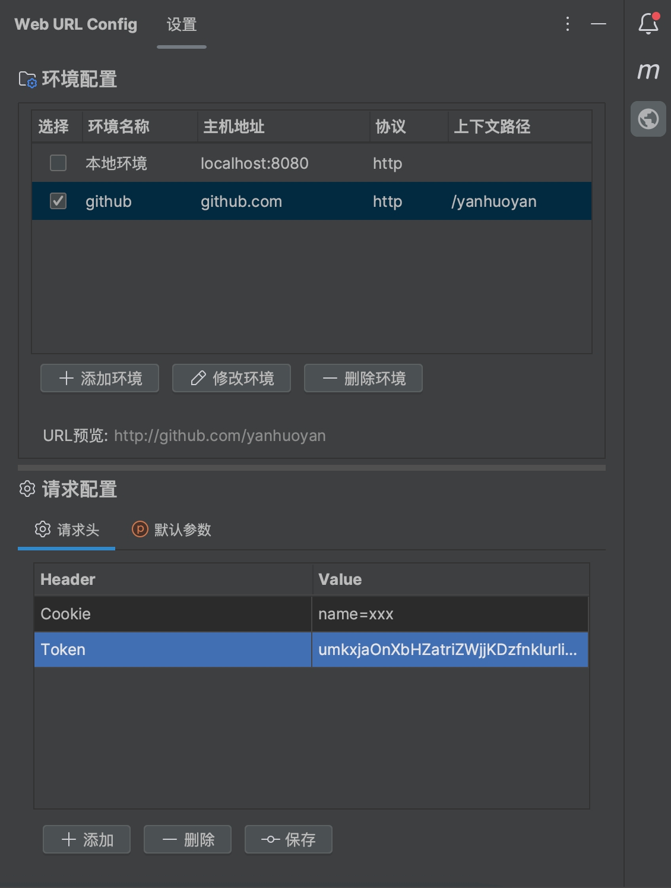
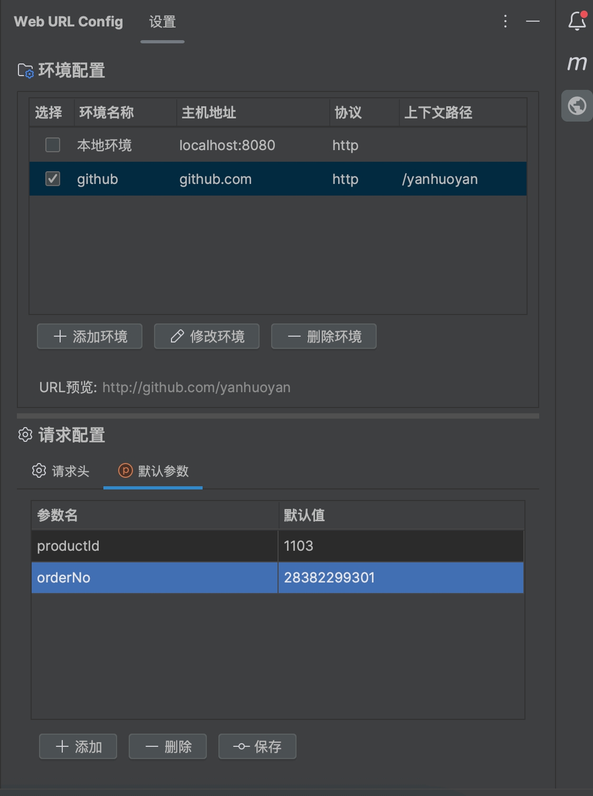

# Web URL Copy

IntelliJ IDEA插件，帮助开发者快速生成当前Java方法的HTTP请求并复制到剪贴板。

简体中文 | [English](README.md)

## 2024.3.5 版本适配说明

针对 IntelliJ IDEA 2024.3.5 版本中出现的内存泄漏问题，本次更新做了如下修改：

1. 新增 `DisposerUtil` 工具类，用于正确处理 Disposable 对象
2. 修改 `ConfigToolWindowPanel` 类，使其实现 Disposable 接口并正确处理资源释放

## 功能特点

- **Bash Curl 命令生成**：直接从Java控制器方法生成并复制curl命令
- **Python Requests 代码生成**：生成格式规范的Python requests代码并复制
- **多种API风格支持**：同时支持Spring MVC和JAX-RS风格的API
- **自定义主机配置**：为不同环境（开发、测试、生产）设置默认主机地址
- **请求头管理**：添加、编辑和删除自定义HTTP请求头
- **方法参数处理**：自动检测并包含路径变量、查询参数和请求体
- **HTTP方法识别**：自动从注解中识别GET、POST、PUT、DELETE等HTTP方法
- **上下文感知菜单**：右键菜单选项仅在兼容的Java方法上显示
- **剪贴板集成**：一键复制生成的请求代码

## 使用方法

1. 在编辑器中打开一个Spring MVC或JAX-RS控制器类
2. 右键点击方法名或类名
3. 在上下文菜单中选择"Web Copy URL" > "Copy Bash Curl"或"Copy Python Request"
4. 请求代码会被复制到剪贴板
5. 通过IDE右侧的"Web URL Config"工具窗口可以配置请求地址和头信息

### 右键菜单



## 配置

通过IDE右侧的"Web URL Config"工具窗口可以：

- 设置不同环境的默认主机地址
- 添加/删除/编辑自定义请求头
- 配置请求的默认内容类型
- 设置认证令牌或凭证（如需要）

### 环境和请求头配置



### 环境和参数配置



## 支持的框架

- **Spring MVC**：支持@RestController、@Controller、@RequestMapping、@GetMapping、@PostMapping、@PutMapping、@DeleteMapping等注解
- **JAX-RS**：支持javax.ws.rs.Path、@GET、@POST、@PUT、@DELETE等注解和路径参数

## 生成输出示例

### Curl命令示例
```bash
curl -X POST 'http://localhost:8080/api/users' \
  -H 'Content-Type: application/json' \
  -H 'Authorization: Bearer token' \
  -d '{
    "name": "张三",
    "email": "zhangsan@example.com"
  }'
```

### Python请求示例
```python
import requests
import json

url = "http://localhost:8080/api/users"

payload = json.dumps({
  "name": "张三",
  "email": "zhangsan@example.com"
})

headers = {
  'Content-Type': 'application/json',
  'Authorization': 'Bearer token'
}

response = requests.post(url, headers=headers, data=payload)
print(response.text)
```

## 构建项目

```bash
./gradlew buildPlugin
```

## 安装插件

- **本地安装**：下载最新的发布版本或自行构建，然后在IntelliJ IDEA中从磁盘安装插件
- **插件市场**：在IntelliJ IDEA插件市场中搜索"Web URL Copy"进行安装

## 开发环境要求

- Java 17+
- IntelliJ IDEA (2022.2 - 2024.3.5)

## 许可证

[MIT License](LICENSE)